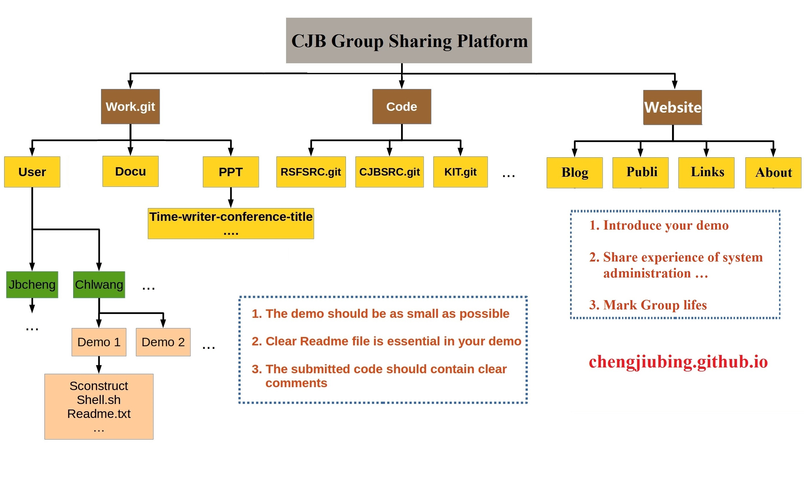

 
> Everyone you will ever meet knows something you don't --Bill Nye 

基于可持续发展、可共享、可复制性和可修改的原则，在王晨龙搭建的内部程序管理版本库的基础之上，构建[程玖兵教授](http://mgg.tongji.edu.cn/space/cjb/main.psp)研究小组的内部资源共享平台。该平台基于目前最流行的版本控制软件(Git), 把小组的源代码托管到加密的中央版本库, 相应的demos,会议PPT以及可复制的发表论文托管在[Github](https://github.com)服务器上。并以github网站为依托，建立小组网站，用于共享小组的资源。此共享平台的目的在于能够有效合理的管理和继承小组里面所有的资源。
     
## 平台构架
<figure>
    	</figure>

## 复制版本库 

$ cd your-local-repository-folder    
$ git clone https://github.com/chengjiubing/work.git      
$ git clone https://github.com/chengjiubing/chengjiubing.github.io    

如果需要学习基本的Git命令可以参见 “Git tutorial - the best version control software ”

