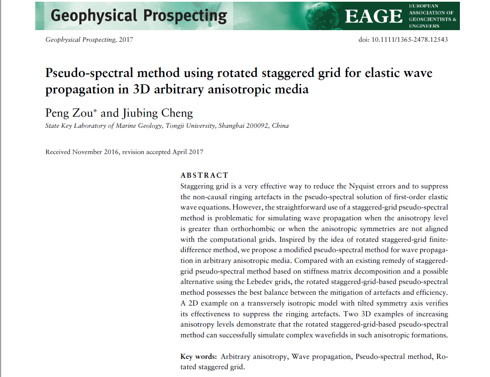

这个[demo](https://github.com/chengjiubing/work/tree/master/user/zp/rsg-psm)是用基于旋转交错网格的伪谱法来模拟地震波在任意各向异性介质中的传播. 该成果已发表在*Geophysical Prospecting* 杂志。详细算法可参考[原文](https://www.researchgate.net/publication/317140220_Pseudo-spectral_method_using_rotated_staggered-grid_for_elastic_wave_propagation_in_3D_arbitrary_anisotropic_media?_iepl%5BviewId%5D=eCSlqk1EfWIH76Ok9FrVOVFM&_iepl%5BprofilePublicationItemVariant%5D=default&_iepl%5Bcontexts%5D%5B0%5D=prfpi&_iepl%5BtargetEntityId%5D=PB%3A317140220&_iepl%5BinteractionType%5D=publicationTitle).    

     

运行此demo需要的源程序有：Mtwolayer2dti.c，Mtwolayer3dti.c, 
Mtti2delastic_cpml.c, Mhti3delastic.c 和Mtti2delrdec_stiffiness.cc。   

+ Mtwolayer2dti.c, Mtwolayer3dti.c  产生二位和三维各向异性模型；
+ Mtti2delastic_cpml.c，Mhti3delastic.c  用旋转交错网格的伪谱法分别模拟地震波
在二位和三维介质中传播；
+ Mtti2delrdec_stiffiness.cc  用于二维各向异性介质中弹性波模式解耦。

